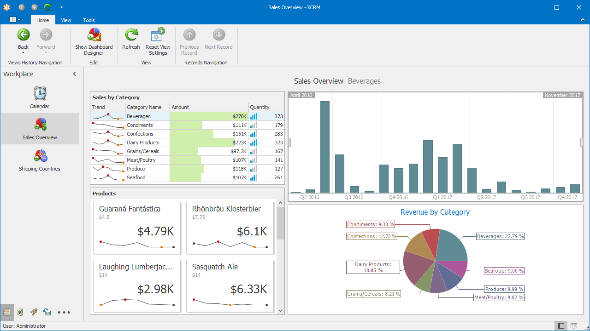

# რეპოში მოცემულია eXpressApp framework-ზე შექმნილი აპლიკაცია, 
რაც არის მსგავსი აღრიცხვის სისტემის, რომლის გასანვითარებლადაც ვეძებთ პროგრამისტს.

Solution-ის დასაბილდად უნდა დააყენოთ https://go.devexpress.com/DevExpressDownload_UniversalTrial.aspx

დემო ვებ-ფორმების აპლიკაცია შეგიძლიათ იხილოთ მისამართზე: https://www.devexpress.com/products/net/application_framework/demos.xml

დემო დესკტოპ აპლიკაციის სკრინკასტი იხილეთ <b><a href="https://www.devexpress.com/Products/NET/Application_Framework/i/screencasts/WinDemo.swf">აქ</a></b>

დემო დესკტოპ აპლიკაციის ვიზუალი არის ასეთი:

----

**სტუდენტების საყურადღებოდ** - დავალება, რომელიც უნდა შეასრულოთ, იხილეთ ფაილში - <a href="https://github.com/DoSo-Management/TypicalDxXafApp/blob/master/დავალება.md">**დავალება.md**</a>
